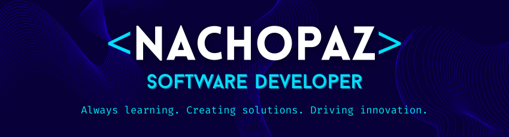

<h1 align="center"><b>Hola, soy Nacho Paz </b></h1>

<!---->

  

## <b> Acerca de mi</b>

📌 Desde los 13 años vivo conectado con la tecnología y la programación. Me destaco por aprender rápido, afrontar desafíos y liderar proyectos innovadores. Busco crecer profesionalmente enfrentando nuevos retos y contribuyendo con creatividad. Disfruto de los proyectos que combinan innovación y trabajo en equipo.

🎓 Actualmente estoy estudiando Ingeniería en Sistemas de Información en UTN-FRT.

🌱 Me encuentro aprendiendo Javascript y React.

📖 Ademas de programar, disfruto mucho leer, ver películas, escuchar música, ir al gimnasio y pasar tiempo con mi seres queridos.

 

## <b> Skills</b>

### Back-End

### Front-End

### Other Tools and Technologies

 

## <b> ¡Conectémonos..!</b>

 

